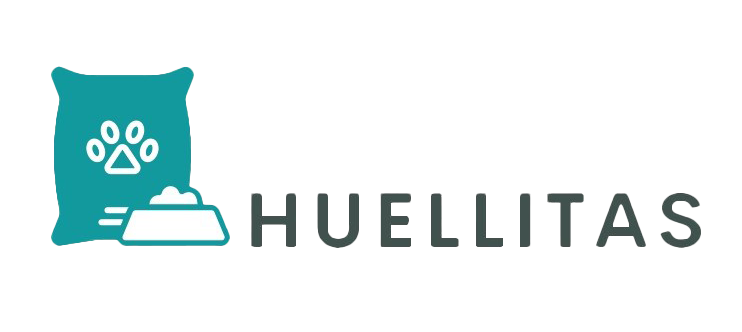

# grupo_12_huellitas
## Proyecto Digital House ##

> HUELLITAS. Todo para familias multiespecie.

# Integrantes del equipo :smile::
- **Lina Barauskas**, 41 años, de la ciudad de Santa Fe, Argentina. Psicóloga, dibujante y Clown. Actualmente, estudiante de programación en la búsqueda de nuevos horizontes. Amante de los gatos y los nuevos desafíos.
- **Analia Fernanda Jaime**, 46 años. Madre de 2 humanos y 2 perras. Licenciada en Administración y MBA.
- **Malena Villa Abrille**, 24 años, Palermo, estudiante Ing. en Sistemas, Desarrolladora de base de datos.
- **Juan Esteban Ruiz**: 28 años. Nací en Tierra del Fuego, crecí en Catriel, Río Negro pero estoy viviendo en Palermo. Contador Público, aunque prefiero contar chistes antes que números.
- **Stiven Alexánder Sánchez Varela**: tengo 28 años; nací en Bogotá, Colombia; soy licenciado en español y filología Clásica, y técnico en diseño gráfico.

# Temática:
El e-commerce tiene como objetivo la venta de productos para mascotas como alimentos o accesorios y pequeños servicios, peluqueria y guarderia, El e-commerce ofrece una amplia gama de productos y servicios diseñados para animales domésticos. Desde alimentos premium hasta juguetes interactivos, y servicios que abarcan desde el cuidado básico hasta el entrenamiento especializado.
El público objetivo es aquél que tenga mascotas o esté pensando en adoptar alguna "Huellitas" es el destino perfecto para aquellos que consideran a sus mascotas como parte integral de su familia, independientemente de cuántas patas tengan.

# Sitios de interés y justificación:
https://www.updogtoys.com/  Up Dog Toys | Modern & Minimalist Toys For Dogs And Puppies diseño limpio. Presentación del producto. Carrito. Historias de clientes.

https://howlpot.com/ HOWLPOT (en chino creo jaja pero está bueno) iconos que llevan a categorías de productos

https://furbo.com/us/products/furbo-360-cat-camera Furbo Cat Camera | Pet Camera designed specifically for cats à diseño minimalista. Log in simple

https://wildone.com/ Wild One à presentación de productos. Tiene una parte que es para ayudar a animales “give back” . También habla de mascotas como parte de la familia. El shop está dividido en categorías que están buenas.

https://laika.com.co/ Está página web cuenta con una distribución clara y de fácil comprensión para el usuario. simplicidad y minimalismo en todo el sitio web.

# Wireframes:

https://xd.adobe.com/view/d24cc48e-4265-425f-bc9d-d8b9a3bd5ea2-871f/

# Tablero de trabajo:

https://trello.com/b/HffSb3Gm/sprint01-26-10-09-11-dh-huellitas-grupo-12

# Paleta de colores:

https://coolors.co/ffffff-16c6cc-11999e-576d69-293533

# Tipografía:

https://fonts.google.com/specimen/Roboto?query=roboto

# Sprints: 

- [x] Sprint 1: 26/10 - 09/11
- [x] sprint 2: 09/11 - 23/11
- [x] Sprint 3: 05/12 - 19/12
- [ ] Sprint 4: 19/12 - 11/01
- [ ] Sprint 5: 11/01 - 01/02
- [ ] Sprint 6: 01/02 - 27/02
- [ ] Sprint 7: 27/02 - 12/03
- [ ] Sprint 8: 12/03 - 26/03
